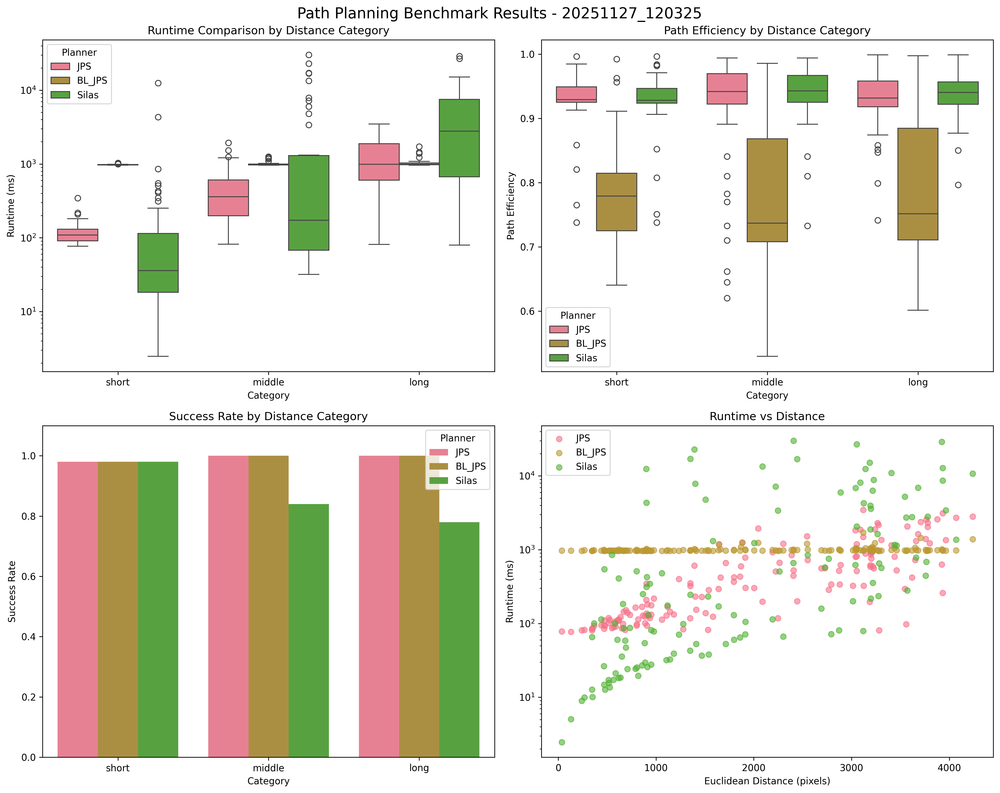
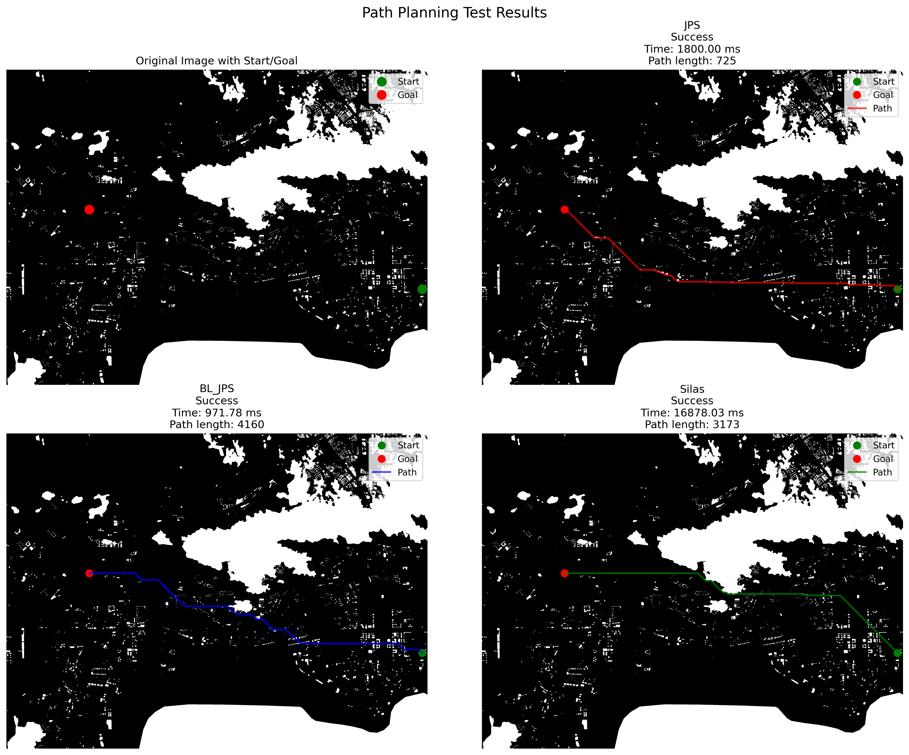

# Repository for Benchmarking Single Agent Path Planning in Large Scale Map

This repository provides a framework and tools for benchmarking single agent path planning algorithms on large-scale maps. It includes C++ implementations, Python bindings, and example scripts for both C++ and Python.

## benchmark result




jps and BL_JPS are relatively faster than SILAS original astar.

## Folder Structure

- `3rdparty/`: Open-source code for single agent path planning, including the AMRA library and its dependencies.
- `dat/`: Example map files in MovingAI format.
- `test/`: Example C++ test programs.
- `python/`: Python bindings and test scripts.

## Building

### Requirements

- CMake >= 3.5
- Boost (filesystem, program_options, system)
- Eigen3
- pybind11 (for Python bindings)
- Python 3

### Build Steps

```sh
mkdir build
cd build
cmake ..
make
```

This will build the C++ libraries, example executables, and the Python extension module.

## Usage

### C++ Example

Run the C++ test program (after building):

```sh
./test/python/test
```

### Python Example

After building, you can run the Python test script:

```sh
python3 3rdparty/amra/python/test.py
```

## Map Format

The framework uses the MovingAI map format. Example maps are provided in the `dat/` directory.

## License

See the LICENSE file if available.

## Contact

For questions or contributions, please contact the project maintainer.


# todo things

## engineering
1. https://github.com/Autodesk/Central64
3. navmesh: navmesh lib + geom
3. vg
3. https://gppc.search-conference.org/

## research track
**learn probability map**
1. https://scholar.google.com/scholar?start=0&hl=en&as_sdt=2005&sciodt=0,5&cites=1423572318423295749&scipsc=

**learn CPD**

## reference
1. https://ojs.aaai.org/index.php/AIIDE/article/view/31882/34049
2. https://github.com/ubco-db/database-pathfinding


## GPU version

### reference
1. https://github.com/jbujak/A-star-CUDA
2. https://ojs.aaai.org/index.php/AAAI/article/view/9367
3. https://github.com/lkoshale/DA_STAR/tree/master


### porting to silas
1. silas planning 2d interface: https://laser-public.coding.net/p/silas/d/silas-os-python/git/tree/master/silas/os/kernel/tspatial_processing/planning/single_agent_planning/single_agent_planning_2d.py#L236;
2. https://laser-public.coding.net/p/silas/d/silas-os-python-p2/git/tree/master: 实习生分支代码；
